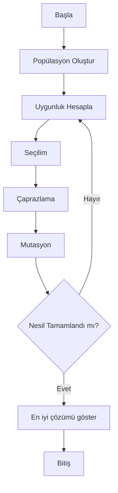

# Genetik Algoritma Nedir?
Genetik algoritmalar, doğadaki evrimsel süreçlerden esinlenen, çözüm uzayında en iyi sonucu bulmaya çalışan metasezgisel (heuristic) optimizasyon yöntemleridir. Özellikle karmaşık, doğrusal olmayan ve çok boyutlu problemlerde klasik yöntemlerin yetersiz kaldığı durumlarda tercih edilir.

## Temel Kavramlar
- **Popülasyon:** Olası çözümlerden oluşan bir grup.
- **Kromozom:** Her bir çözümün (bireyin) genetik temsili.
- **Uygunluk (Fitness):** Bir çözümün ne kadar iyi olduğunu belirten değer.
- **Çaprazlama (Crossover):** İki çözümün genlerini karıştırarak yeni çözümler üretme.
- **Mutasyon:** Çözümde küçük rastgele değişiklikler yapma.

---

# Örnek Problem: x^2 Fonksiyonunu Maksimize Etmek
Belirli bir aralıkta (örneğin [-10, 10]) `f(x) = x^2` fonksiyonunu maksimize eden x değerini bulmak istiyoruz. Bu, genetik algoritmaların temel mantığını göstermek için ideal bir örnektir.

## Python ile Adım Adım Genetik Algoritma
Aşağıda, temel bir genetik algoritma akışını ve kodunu bulabilirsiniz:

```python
import numpy as np
import random

# Parametreler
deger_araligi = (-10, 10)
populasyon_boyutu = 50
mutasyon_orani = 0.01
caprazlama_orani = 0.7
nesil_sayisi = 100

def uygunluk(x):
    return x ** 2

def birey_olustur():
    return random.uniform(*deger_araligi)

def populasyon_olustur():
    return [birey_olustur() for _ in range(populasyon_boyutu)]

def secilim(populasyon, uygunluklar):
    secilenler = []
    for _ in range(len(populasyon)):
        adaylar = random.sample(list(zip(populasyon, uygunluklar)), 3)
        secilenler.append(max(adaylar, key=lambda x: x[1])[0])
    return secilenler

def caprazla(ebeveyn1, ebeveyn2):
    if random.random() < caprazlama_orani:
        alpha = random.random()
        return alpha * ebeveyn1 + (1 - alpha) * ebeveyn2
    return ebeveyn1

def mutasyon(birey):
    if random.random() < mutasyon_orani:
        birey += random.uniform(-0.5, 0.5)
        birey = np.clip(birey, *deger_araligi)
    return birey

populasyon = populasyon_olustur()
for nesil in range(nesil_sayisi):
    uygunluklar = [uygunluk(b) for b in populasyon]
    secilenler = secilim(populasyon, uygunluklar)
    yeni_populasyon = []
    for i in range(0, populasyon_boyutu, 2):
        ebeveyn1 = secilenler[i]
        ebeveyn2 = secilenler[i+1] if i+1 < populasyon_boyutu else secilenler[0]
        cocuk1 = mutasyon(caprazla(ebeveyn1, ebeveyn2))
        cocuk2 = mutasyon(caprazla(ebeveyn2, ebeveyn1))
        yeni_populasyon.extend([cocuk1, cocuk2])
    populasyon = yeni_populasyon[:populasyon_boyutu]

son_uygunluklar = [uygunluk(b) for b in populasyon]
en_iyi_idx = np.argmax(son_uygunluklar)
print(f"En iyi x: {populasyon[en_iyi_idx]:.4f}, f(x): {son_uygunluklar[en_iyi_idx]:.4f}")
```

---

## Sonuç ve Yorum
Bu örnekte, genetik algoritmanın temel adımlarını ve Python ile nasıl uygulanacağını gördük. Gerçek dünyada genetik algoritmalar; rota optimizasyonu, makine öğrenmesi hiperparametre ayarı, oyun yapay zekası gibi birçok alanda kullanılmaktadır.

---

## Akış Diyagramı



---

Daha karmaşık örnekler ve gerçek dünya uygulamaları için [Metasezgisel Optimizasyon](../topics/metasezgisel-optimizasyon/) bölümüne göz atabilirsiniz. 